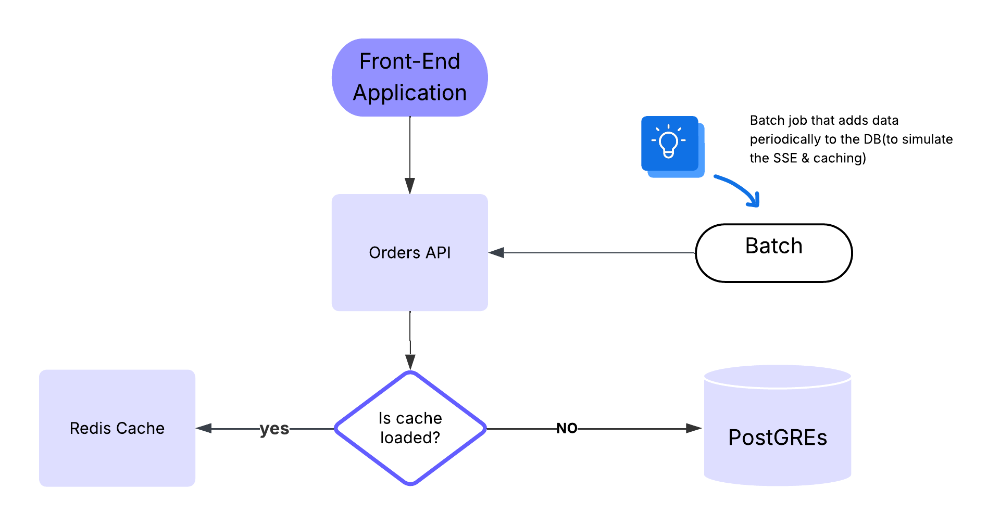

## Getting Started

To run the entire application locally:

```bash
docker-compose up -d
```

This will start all services including the database, cache, backend API, frontend, and the batch job service that creates sample orders.


# rem-soft-mock
Remsoft's test of a mock order management API 



## About This Repository

This is a demo  order management system.
It has the following entities: 

1. Front-end
2. Back-end monolith (written in java/spring)
    - Only create endpoints are the ones used in the front-end app. 
3. Relational Database (POSTGREs)
4. Redis cache
    - This is used to decrease the load on the database, 
5. Order simulation CronJob
    - Runs every 3-15 secs to simmulate realtime orders and to display the SSE connection. 


